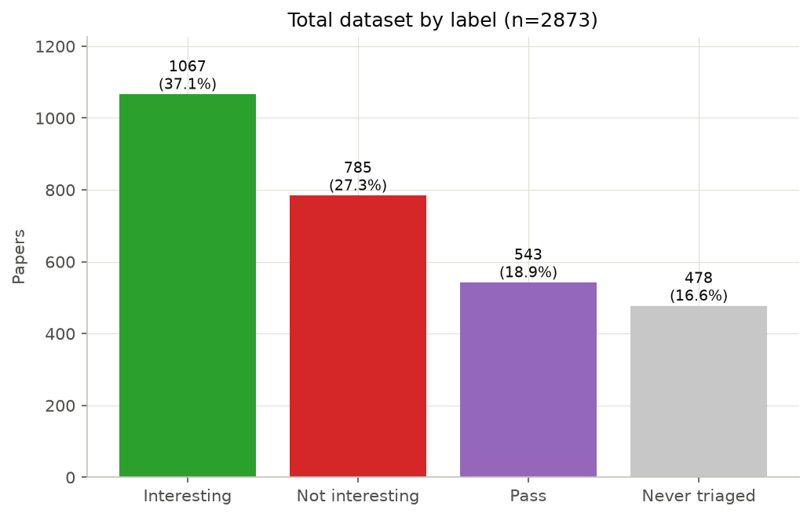
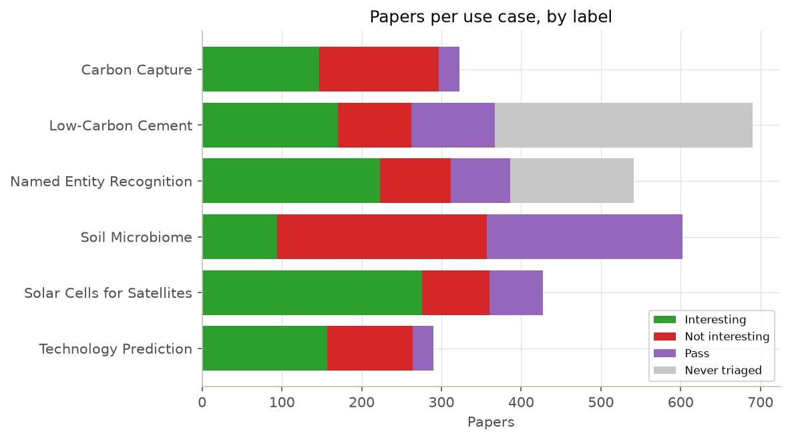
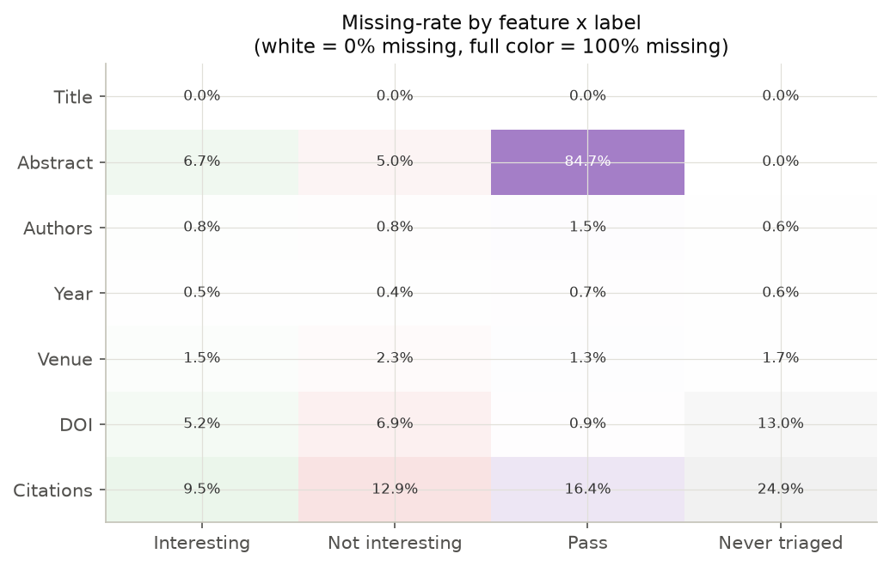
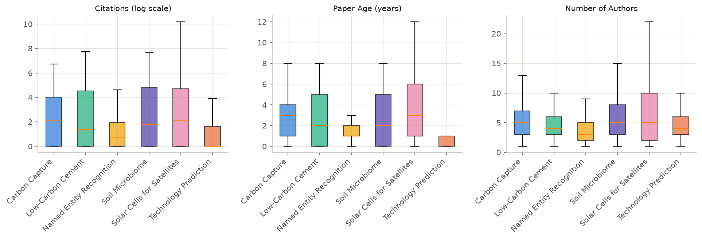
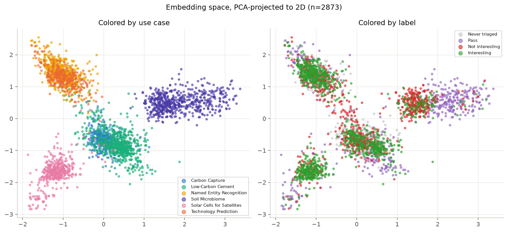

# TIRI — A Radar for Interesting Science

**How we built a model that reads a research brief and ranks the scientific literature
against it — and what four weeks of measurement taught us**

Sylvain Fossier & Warren Fauvel · August 2026
Technology Intelligence Radar for Industry (TIRI)

---

## In one page

An industrial R&D team decides where to put tens of millions of pounds across dozens of
technology areas. To decide well, someone has to know what is happening in the science.
The science is unreadable at volume: too much of it, written in specialist language,
scattered across a dozen databases.

**TIRI is a radar.** An analyst writes down what they are looking for. A search returns a
few hundred to a hundred thousand candidate papers. TIRI ranks that pile so the ones worth
reading come first.

Four things we can now say with evidence behind them:

1. **It works.** On a research question we have labels for, the shipped model ranks a
   relevant paper above an irrelevant one **82–91% of the time**. Tested on 28 published
   screening projects that nobody on this team touched, the median score is **0.93**.

2. **The obvious way to build it is measurably wrong.** Train one model across all six of
   our research questions and it looks excellent — right up until it meets a *new*
   question, where it performs **no better than a coin flip**. The reason is specific and
   we measured it: the model learns *which question it is looking at*, not what makes a
   paper relevant.

3. **The model was never the bottleneck.** Three quite different algorithms, judged
   fairly, land within **half a percentage point** of each other. What moved the needle was
   how the problem was framed, not which algorithm was used.

4. **A large language model does not replace it.** We set a pass mark before running the
   test — beat the cheapest possible baseline on at least 6 of 8 datasets. Every model we
   tried, from 20 billion to 397 billion parameters, won exactly **3 of 8**. It fails the bar.

Everything below is traceable to a committed notebook or report in the project repository.
Where a claim did not survive a later test, we say so — the things that did not work are
most of what we learned.

---

## 1. The problem, and the radar

### 1.1 The situation

A corporate R&D function commits large, multi-year budgets across many "solution spaces" at
once. Beneath it sits a technology intelligence team, usually fragmented, serving several
use cases per solution space. Beneath them sits the person who actually does the work — a
technology analyst with deep knowledge of one specialism and a brief that changes every few
months.

That analyst's problem has three parts:

- **Volume.** More science is published each year than any team can read.
- **Language.** It is written by specialists, for specialists, in vocabulary that shifts
  between subfields.
- **Fragmentation.** Search, triage, note-taking and reporting live in different tools, and
  nothing carries the analyst's judgement forward.

### 1.2 A worked example

> **Use case:** *Acquire promising carbon-capture IP from university spin-outs.*
> **Narrowed to:** low-energy industrial point solutions, amine-based reagents.
> **Vocabulary:** industry emissions, carbon capture, amines, reagents, efficient heat
> transfer systems, membranes…

A search on those terms returns several hundred papers. Perhaps a third are relevant. The
analyst has time to read fifty. **Which fifty?** That is the entire question TIRI answers.

### 1.3 The radar

The metaphor we use throughout is a radar, and it is more than decoration — it describes
how the system is tuned.

| Radar | TIRI |
|---|---|
| Define what you are scanning for | The analyst writes a structured **brief**: objective, must-have terms, nice-to-have terms, exclusions, decision rules |
| Set the frequencies | The analyst labels a few hundred papers *interesting* / *not interesting* |
| The radar sweeps | The model ranks the whole pool |
| Contacts are classified | The analyst reads the top of the ranking, and their corrections retune the radar |

Two consequences of the metaphor that turn out to be literally true in the measurements
later: **a radar tuned for one target is not tuned for another** (§5), and **you get a
better return by improving the tuning than by buying a bigger radar** (§7.3).

---

## 2. What "interesting" means, and why we grade it with F2

### 2.1 Two ways to be wrong

Any ranking system makes two kinds of mistake, and they cost different amounts.

- **A false positive** — the model flags a paper that turns out to be irrelevant. Cost: the
  analyst wastes a few minutes reading it. Annoying, recoverable.
- **A false negative** — the model buries a paper that mattered. Cost: **the insight is
  simply never found**. Nobody knows it was missed. Unrecoverable.

Two standard measures capture this:

- **Precision** — of the papers the model flagged, what share were actually relevant?
  *"Only the right answers, but some were missed."*
- **Recall** — of the papers that were actually relevant, what share did the model flag?
  *"All the possible right answers, but some wrong ones came along."*

### 2.2 F2

You cannot maximise both. F-scores combine them into one number with an adjustable weight.
**We use F2, which counts recall as twice as important as precision.**

> **The rule this encodes:** don't miss weak signals. A weak signal that reaches the
> analyst can be discarded in thirty seconds. A weak signal that never reaches them is
> gone.

Precision optimisation comes later in the product's life, once a use case has accumulated
enough labels for the analyst to prune. In this phase, **we do not trade recall for
precision.**

### 2.3 One caveat, stated early because it recurs

F2 depends on **how common relevant papers are** in the pool being scored. In our own six
research questions, between 26% and 77% of papers are relevant. In a real production
harvest of 100,000 papers, the figure is low single digits.

That difference matters enormously. In a pool that is 77% relevant, a model that simply
marks *everything* relevant already scores F2 = 0.87 — the metric cannot tell good from bad
because there is nothing to skip. §7 is where we fix this by testing on realistic data, and
several conclusions change when we do.

---

## 3. The workflow, and where TIRI sits in it

### 3.1 The loop

The product is a loop, not a pipeline. Each pass through it sharpens the definition of
"interesting".

| # | Stage | What happens | Volume |
|---|---|---|---|
| 1 | **Define the use case** | The analyst fills in a structured brief (a JSON schema, LLM-assisted) | 1 brief |
| 2 | **Search / retrieve** | Queries fan out across academic databases, results deduplicated | 100–500 papers |
| 3 | **Label** | The analyst triages each paper: interesting / not interesting / pass | 100–500 labels |
| 4 | **Create / train model** | Cleaning, exploratory analysis, feature engineering, ensemble — **this is TIRI** | — |
| 5 | **Expand the harvest** | The trained model labels a much larger pool | 1k–100k papers |
| 6 | **Refine the use case** | The analyst re-labels where the model erred; the brief is revised; return to 1 | — |

The data sources are **OpenAlex, Crossref, arXiv, Semantic Scholar** (plus PubMed, Europe
PMC and CORE). A local application handles the explore / enrich / predict cycle so the
analyst's judgement stays in one place.

### 3.2 What TIRI is, precisely

TIRI does not search and does not label. A sibling tool runs the search-and-triage loop and
exports one row per paper — title, abstract, metadata, the analyst's label, and a
precomputed numeric representation of the text. **TIRI consumes that export and does one
job: rank the pool so the relevant papers surface first.**

### 3.3 Three product constraints that decided the architecture

These come from the product, not from the data, and they rule out several designs that
would otherwise be obvious.

1. **High recall first.** F2 is the objective (§2).
2. **Use cases are per-customer and siloed.** There is no shared pool of papers, only
   shared tooling. Each customer's model is trained on their own labels, in their own silo.
   What crosses a silo boundary is a *configuration* — feature definitions, model class,
   default settings — **never** trained weights and never data. **No pooled model ever
   ships.**
3. **Scale, cost and determinism.** 100,000+ papers, at low cost, 100% reproducible, on
   infrastructure the customer controls.

Constraint 2 is the reason the evaluation everybody reaches for first is not the number
that matters, and §6.1 sets that out carefully.

---

## 4. The data

### 4.1 What we have

Six research questions, created from a mix of professional experience and desk research,
each with its own hand-written brief and its own hand-labelled papers.

| Research question | Papers |
|---|---:|
| Low-carbon cement binders | 690 |
| Soil microbiome quality | 602 |
| Named entity recognition | 541 |
| Solar cells for LEO satellites | 427 |
| Carbon capture | 323 |
| Predicting technology developments | 290 |
| **Total** | **2,873** |

Each row carries roughly 50 columns: bibliographic metadata (DOI, title, abstract, venue,
citation count, year, authors), which database it came from, the analyst's label — and a
384-number **embedding**.

> **What an embedding is.** A model reads the title and abstract and turns them into a list
> of 384 numbers, positioned so that papers about similar things end up close together.
> Machine-learning models cannot read text; they can compare numbers. This is the bridge.

### 4.2 The labels are four facts, not three

*Figure 1 — The full corpus of 2,873 papers by label.*

*Pass* and *never triaged* look similar and are completely different facts. ***Pass* means
an analyst looked and could not decide. *Never triaged* means no human ever saw it.**

And *pass* turned out not to be analyst hesitation at all: **84.7% of *pass* papers have no
abstract**, against 5–7% for decided papers. The analyst had nothing to read. It is a data
completeness problem wearing a judgement's clothing — which is why we drop it and keep the
target strictly binary. Building a three-way "interesting / borderline / not" model would
have encoded missing data as an opinion.

That leaves **1,852 usable labels** (1,848 after deduplication).

*Figure 2 — Labels by research question. Note how differently the six behave: soil
microbiome is mostly* not interesting*, solar cells mostly* interesting*, and low-carbon
cement is largely un-triaged.*

> **The caveat attached to every F2 number in this document.** Relevant-paper rates run
> **26% to 77%** across these six questions. Production runs low single digits — roughly
> **20× lower**. Every decision threshold we measured on this corpus was measured in the
> wrong regime. §7 is the correction.

### 4.3 Missing data behaves differently by label

*Figure 3 — Missing-data rate for each field, split by label. The abstract row is the
finding.*

This drove one non-negotiable convention: **NULL is not 0.** "We looked and there was
nothing" and "we never found out" are different facts. A missing citation count means no
database recorded one — not that the paper has zero citations. Every feature built over a
sparse field emits a genuine *missing* marker plus a flag, rather than quietly filling in
a zero and inventing data.

### 4.4 The six questions are not interchangeable

*Figure 4 — Citations (log scale), paper age, and author counts, per research question.*

- **Citations** are heavily skewed everywhere — the most-cited paper in the corpus has
  26,506 citations, verified genuine.
- **Age** splits by field: digital-technology questions skew much younger. Technology
  prediction is almost entirely papers under one year old; solar cells for satellites
  reaches back to 1974.
- **Author counts** are higher in the hard sciences than in the computational ones.

This heterogeneity is why we never quote an average across the six without also saying how
many of the six it won on. An average over six very different questions can be won by being
good at the easy ones.

### 4.5 The chart that reframed the project

*Figure 5 — The same 2,873 papers, plotted twice. Left: coloured by research question.
Right: coloured by label.*

Both panels show the same thing: every paper compressed from 384 numbers down to two, so it
can be drawn on a page. Papers that sit close together are papers the model considers
similar.

**Left panel: six clean, well-separated clusters.** The numbers know exactly which research
question each paper belongs to.

**Right panel: green and red thoroughly mixed inside every cluster.** The numbers do *not*
know which papers are interesting.

> **That gap — sharp by question, blurred by label — is the project.**

We put a number on it. Fit a classifier to predict *which research question a paper belongs
to*, from its embedding alone: **96.2% accuracy**, against 19% for guessing the most common
one. The embedding is not noisy. It is an extremely precise fingerprint — **of the topic,
not of relevance.**

§5 is what happens when you build a model on top of a fingerprint like that.

---

## 5. The finding that reshaped the project

### 5.1 The test

The obvious approach is: pool all six questions, train one model, ship it. We did that, and
on a random hold-out drawn from the same six questions it scores well.

But the product's real question is different: **how will this do on a customer's brand-new
research question?** To simulate that, we hid one question entirely, trained on the other
five, and tested on the hidden one — rotating through all six so no single question could
carry the result.

> **How to read the scores below.** ROC-AUC answers: pick one relevant paper and one
> irrelevant paper at random — how often does the model rank the relevant one higher? **0.5
> is a coin flip. 1.0 is perfect.**

| Model | On questions it has seen | On a brand-new question |
|---|---:|---:|
| Gradient boosting | 0.816 | **0.505** |
| Random forest | 0.808 | **0.502** |
| Logistic regression | 0.759 | **0.536** |
| *A coin flip* | — | *0.500* |

**It does not transfer at all.** And two of the six rotations put the tree-based models
*below* the coin-flip line — meaning that on a genuinely new question, deploying one carries
real downside, not merely less upside.

Recall collapsed harder than the table suggests. In-distribution the models catch 72–83% of
relevant papers. On a new question they catch **8–20%**. Four out of five relevant papers
would be lost.

### 5.2 Why — and why it is not the usual explanation

The reflex diagnosis is *overfitting*: too many features, model memorised the training data.
We tested that and it is wrong, or at least mostly wrong.

Separating the two effects — the gap from memorising training data, versus the gap from
being handed an unfamiliar domain — puts **60–65% of the collapse on domain shift**, not
overfitting. Simplifying the model would close only the smaller half.

Three further measurements pin it down:

| What we measured | Result | What it means |
|---|---:|---|
| Predict *which research question* from the embedding | **96.2%** (19% baseline) | The features encode topic identity, and topic identity is useless on an unseen topic |
| Subtract each question's average position, to remove the topic | 0.532 → **0.529** | No effect. **You cannot subtract your way out** — the relevant direction is different in every question |
| Ten features that compare paper *to brief*, vs the full 384-number embedding | **0.642** vs 0.537 | **Ten beat 384.** It was never the feature count; it was the feature *kind* |

And the strongest form of the result: with **zero labels**, simply ranking papers by how
similar they are to the brief scores **0.693** on a new question — beating every supervised
model trained on the other five questions (**0.610**).

> **A model trained on other customers' questions is worse than no model at all.**

### 5.3 The finding

> **Relevance is a property of the *(brief, paper) pair*, not of the paper.**
>
> There is no such thing as an interesting paper. There is only a paper that is interesting
> *for this question*.

Every feature the project had built up to that point described the paper alone — how often
it was cited, how many authors, how new, what it was about. None of them read the brief. So
the model had no way to learn a relationship, only a topic.

### 5.4 Confirmed on data we did not produce

The argument above rests on our own six questions. We later obtained 28 published
systematic-review screening projects, labelled by the domain experts who ran them, where
the same paper genuinely appears under several different questions.

> **3,137 papers were screened under more than one question, and 130 of them are labelled
> *relevant* under one and *not relevant* under another** — the same title, the same
> abstract, judged by expert reviewers, coming out differently because the question changed.

Stated with its own limit: 130 is a small number, and 96% of shared papers *are* labelled
consistently — which is expected, since two reviews that both surface a paper are usually
about adjacent topics. This shows the effect is real on external data. It does not measure
how big it is.

### 5.5 What changed as a result

Three rules, and they govern everything after this point:

1. **Features must read the brief.** We built a block of features that compare each paper
   directly against its own question's brief — keyword overlap, weighted term matching,
   similarity of meaning, and each paper's rank within its own question on those measures.
2. **Models are fitted per question, never pooled.** Which happens to be exactly what the
   product's silo constraint (§3.3) already required. The evidence and the commercial
   requirement agree.
3. **Below about 25 labels, ship the zero-label ranker** — rank by similarity to the brief
   and use the top of that list to choose what to label next. Above 25, train.

### 5.6 The control that keeps us honest

There is an obvious way to fool yourself here. A feature that claims to "read the brief"
might just be measuring something generic — abstract length, say, or how technical the
writing is — and scoring well for the wrong reason.

> **Every feature that claims to read the brief must survive a falsification test: rebuild
> it against deliberately *wrong* briefs. If it still scores well, throw it away.**

We score each question's papers against a *different* question's brief and re-measure.

| Feature block | Score |
|---|---:|
| Brief-reading features, **real** briefs | **0.642** |
| Brief-reading features, **wrong** briefs | **0.488** |

Real briefs beat wrong briefs on 5 of 6 questions. The features are genuinely reading the
brief. This control caught more than one plausible-looking feature that was not, and it is
the single practice from this project we would most recommend copying.

---

## 6. Building the ranker, and what actually ships

### 6.1 Four different questions, four different scores

This is the most common way to misread the project, so it comes before any numbers.

| The question being asked | What it is | Headline |
|---|---|---|
| **"More papers from a question we already know"** | A random hold-out from the same six questions. The standard textbook comparison — and **explicitly not a test of generalisation** | ROC-AUC **0.889** |
| **"A brand-new question, no labels"** | Hide one question entirely. A tool for choosing sensible *defaults* for a new customer — **never** a claim about how well TIRI works | **~0.54** — it doesn't. §5 |
| **"A new paper for a question we have labels for"** | One model per question. **This is what ships** | **0.816–0.906** |
| **"Somebody else's questions, at realistic rates"** | 28 external projects nobody here labelled, at ~2% relevant | Median **0.928** |

**These four numbers are not comparable to each other.** Quoting the first as though it
were the third is the easiest mistake available here.

### 6.2 The model comparison

Three models on the same data, the same split, the same features — so any difference is a
model difference. Scores are F2 (§2.2), as percentages.

| | Train (60%) | Validate (20%) | Test (20%) |
|---|---:|---:|---:|
| **Baseline** — logistic regression, untuned | 84.1% | 82.0% | **79.0%** |
| **Ensemble** — CatBoost + random forest + logistic regression | 95.8% | 90.6% | **89.2%** |

Two things to read here. First, **the gap between the three columns matters as much as the
height**: a model that scores far better on data it trained on than on data it has not seen
has memorised rather than learned. Flatter is better. Second, an estimated practical ceiling
for this task sits around 86%, and anything above roughly 80% is useful to an analyst.

**Why an ensemble?** Three different algorithms make three different *kinds* of mistake. A
gradient-boosting model finds sharp conditional rules; a linear model finds broad smooth
trends; a random forest sits between them. Averaging their opinions cancels errors that any
one of them makes alone — three radars on different frequencies, cross-checking each other's
contacts.

### 6.3 Two honest caveats on that table

We tested every comparison with a statistical procedure that asks *"if we re-ran this on a
slightly different sample of papers, would the winner change?"* It changed what we were
allowed to claim.

**(a) The advanced models barely beat the simple one.** Judged fairly — each model at its own
best setting — logistic regression scores 0.903, CatBoost 0.902, random forest 0.898. **A
spread of 0.005.** The ensemble's advantage (0.910) comes from *combining* them, not from
any one being better. Relatedly, three different hyperparameter search strategies landed
within 0.0024 of each other: at this budget, the tuning strategy barely matters either.

**(b) The headline win is partly a decision-threshold effect.** The often-quoted "+0.101
F2 over the baseline" compares a *tuned* ensemble against an *untuned* baseline. On a
like-for-like comparison the gap is **+0.020**, and that smaller gap is not statistically
significant. What *is* significant, and does hold up, is that the ensemble is a genuinely
better **ranker** (+0.022, p=0.005) — which is the property that actually matters, because
the analyst reads from the top of a list.

> **This is the second time the project found the same thing: the model was not the
> bottleneck.** Framing the problem correctly (§5) was worth far more than any algorithm
> choice.

### 6.4 What ships

**One model per research question, trained only on that question's own labels** — a
CatBoost branch and a logistic-regression branch, averaged.

| Research question | Labels | % relevant | **ROC-AUC** |
|---|---:|---:|---:|
| Low-carbon cement | 262 | 65% | **0.906** |
| Carbon capture | 295 | 50% | 0.887 |
| Solar cells for satellites | 358 | 77% | 0.846 |
| Technology prediction | 264 | 60% | 0.841 |
| Named entity recognition | 312 | 72% | 0.836 |
| Soil microbiome | 357 | 26% | **0.816** |

Both branches beat a strong single-model baseline on every question, by between 0.03 and
0.18. The plain 50/50 average matches or beats both of its own branches on 3 of 6 questions
— a free win that needs no clever combiner. We tested learned combiners twice; both times
they tied with plain averaging, so plain averaging ships.

### 6.5 How to operate it

> **Read the top *k*% of the ranking. Do not use a fixed probability cut-off.**

A probability threshold calibrated on a pool that is 60% relevant is meaningless on a pool
that is 2% relevant. **Rank order survives that shift; a threshold does not.** So the
operating instruction is "read the top 10%", not "read everything above 0.7".

**The cold-start ladder:**

| Labels available for this question | What to use |
|---|---|
| **0–24** | Rank by similarity to the brief. No training. Use the top of that ranking to choose what to label next |
| **25+** | The full per-question ensemble |

That second row carries a warning we measured directly. At realistic relevance rates,
**57% of random 25-paper samples contain no relevant paper at all** — nothing to train on.
So "the customer arrives with labels" is only safe if those labels were **actively chosen**
(by labelling the top of a ranking, for instance), not sampled at random.

---

## 7. Does it work on data we didn't label? Could an LLM just do it?

Everything so far was measured on data this team produced, at relevant-paper rates roughly
20× higher than production. This section is the correction, and it is where the least
self-graded evidence lives.

### 7.1 External validation

**Three published systematic reviews** we had no hand in labelling (1.7–14.8% relevant):
the shipped per-question ensemble reaches a **mean ROC-AUC of 0.899**, against 0.888 for the
best single-model baseline ever measured on this project.

**Twenty-eight published screening projects** — 181,199 papers, **1.86% relevant** overall,
real expert labels, briefs written without sight of the labels:

| Approach | Median ROC-AUC |
|---|---:|
| Random | 0.502 |
| Similarity to the brief (**zero labels**) | 0.90 |
| Trained model on metadata features | 0.884 |
| **Trained model on the embedding** | **0.928** |

**There is real, learnable signal at 1.86% relevant** — the first time this project
demonstrated that outside its own enriched pools. In practical terms, on the median project
**an analyst could skip 36–60% of the pile and still find 95% of the relevant papers.**

Two confounds this larger corpus made visible, which we report because they are the kind of
thing that quietly inflates a result:

- **Citation count separates relevant from irrelevant in 24 of 27 projects — and in 23 of
  those, relevant papers are the *less*-cited ones.** The mechanism is visible in the
  outliers: the eight most-cited papers in the whole corpus are all labelled *not relevant*.
  They are statistical methods and measurement instruments — the sort of thing a search
  returns and a reviewer excludes. A naive "cite counts signal quality" feature would have
  pointed the wrong way.
- **In 5 of 28 projects, publication year alone ranks relevant papers above 0.70.** Those
  projects measure a date filter, not relevance. We fit a year-only comparison alongside
  every real model specifically to keep this visible, and never quote those projects as
  evidence that a feature works.

### 7.2 Could a large language model just do this instead?

At the midpoint of the project this was genuinely open, and listed as such. It is now
settled.

In the radar metaphor, an LLM is the **spotter plane**: it can be sent anywhere without
preparation and it reads the actual text, but each sortie costs real money, it is slow, and
it does not give the same answer twice.

We tested four open-weights models from 20 billion to 397 billion parameters, four prompt
designs, **89,937 responses for $16.10**, on the 8 largest external projects (62,229 papers,
2.19% relevant).

> **The pass mark was fixed before the run: beat the free zero-label baseline on at least
> 6 of 8 projects. Every model won exactly 3 of 8. Fail.**

Two of our *own* earlier conclusions also died at realistic rates, which is why this section
exists:

- **The model ranking scrambled completely.** A model that ranked 2nd of 4 in our own pools
  came last; one that ranked 3rd came 1st. The earlier conclusion "performance saturates
  around 31 billion parameters" was an artefact of the wrong relevance rate.
- **A prompt trick worth +0.35 F2 in our pools was worth ±0.03 here.** Telling the model "a
  missed paper costs about five times a false alarm; when unsure, include" is excellent
  advice at 60% relevant. At 2.19% relevant, each extra inclusion costs about 45 false
  positives per true one — it more than doubles the reading pile to gain 10 points of
  recall. A net loss.

**Conclusion: the LLM does not replace the ensemble, and it does not replace the free
zero-label ranker either.**

### 7.3 But a better brief beats a bigger model

The most useful thing to come out of the LLM work was not about LLMs.

We showed a strong model 30 relevant and 30 irrelevant papers and asked it to *write down
the screening rule it inferred*. One call, **$0.006**. Then we gave that induced brief to
each of the system's components in place of the analyst's original.

| Who reads the brief | Supplied brief → induced brief | Change |
|---|---|---:|
| Keyword-matching features | 0.733 → **0.798** | **+0.065** |
| The LLM reader | 0.777 → **0.834** | **+0.057** |
| Similarity-to-brief ranking | 0.774 → 0.778 | +0.004 |

> **For scale: the entire performance spread across four model families from 20B to 397B
> parameters is 0.030. A better brief is worth twice a 13× larger model.**

**But it is a cold-start lever and nothing else.** Fold the same induced brief into the
trained per-question ensemble and it is worth **+0.001**, with none of the 8 projects moving
past the noise floor. The improvement is already contained in what the trained model can
see; it only looked like new information because the isolated component could not see it.

The same result appears from the other direction: rewriting all six of our own briefs to a
best-practice standard moved the *trained* model's F2 by **+0.003**, well inside the
run-to-run wobble of leaving them alone.

> **Brief quality is the largest lever we found — and it pays before labelling starts, not
> after.** Which is exactly the conclusion the product team had already reached from a
> different direction: a hand-written relevance policy scored *worse than no policy at all*
> because it promoted the very category the labels rejected. **The definition must be
> elicited from the analyst's decisions, not from their prose.**

**And a hard bound on it.** On one project, a small trained model reached 0.639 while **no
LLM under any brief — including one distilled from those exact labels — beat chance.** Some
inclusion rules are learnable from examples and simply cannot be written down as a rule.
"Distil the labels into a brief" is not a general substitute for training.

---

## 8. How we decide a number is real, what didn't work, and what's next

### 8.1 The standard of evidence

Six questions of 260–360 labels each is a small, varied sample, and it has already produced
one decision made on noise. Five rules protect against that.

**1. The noise floor is measured, not assumed.** Re-run the same experiment with a different
random seed and scores move by about **0.010** on their own. So:

> **Any gap smaller than about 0.03 is treated as not established, whichever way it points.**

Several results in this project that look like wins are labelled ties for exactly that
reason — including the choice of embedding model, where the entire spread between the three
candidates is 0.027, one standard deviation.

**2. Cross-validated, never train-then-score.** Every number quoted is on data the model did
not see. One genuine leakage bug was found in an early analysis; it is documented in place
rather than quietly fixed.

**3. Win counts beside every average.** An average over six heterogeneous questions can be
won by being good at the easy ones.

**4. Statistical tests, not point estimates,** for every comparison — which is what caught
the headline F2 claim being a threshold story (§6.3b).

**5. Pass marks and instrument checks set before results.** The LLM contest's 6-of-8 bar was
fixed in advance and reported as a fail. Two other proposed measures also failed their
pre-set bars and were not shipped. Two harness bugs were caught by checking the instrument
before trusting it — one of them **five times larger than the effect being measured**.

### 8.2 What didn't work

The most valuable asset in the project is the list of things we measured and rejected, so
nobody spends the money again. In plain terms:

| We tried | It didn't work because |
|---|---|
| Eleven metadata features (citation velocity, author count, venue quality, language…) | All eleven together were worth almost nothing, and they *hurt* on unseen questions — they encode which question it is |
| Estimating technology readiness from the text | 53% agreement with a hand-labelled sample. Barely better than guessing |
| Journal quality scores from OpenAlex | Essentially uncorrelated with the label. It just re-measures citation count |
| Adding a fourth and fifth model to the ensemble | Three attempts, three rejections. The models agree with each other too much to add anything |
| Compressing the embedding inside a question | Helped when transferring between questions, hurt in production. A transfer trick, not a production one |
| Recalibrating the model's probability outputs | Average benefit ≈ zero, with noise 50× the average, and *negative* on one question |
| Using a prompted LLM instead of the ensemble | Loses on ranking; fails a pre-registered 6-of-8 bar as a cold-start replacement |
| Giving the LLM reader curated keyword lists | Ranking unchanged, and recall got *worse*. Keyword lists help keyword matchers and hurt readers |
| Asking the LLM to check criteria one by one | Worse on 3 of 4 models — the scaffolding makes it demand that *every* criterion be met |
| Scoring how well-written a brief is, with a single number | Three independent attempts, three failures. There is a structural reason: a defect that is expensive before labelling is cheap after, and vice versa, so no single number can average both regimes |

Appendix B carries the same table with the measurements attached.

### 8.3 What we cannot yet claim

Stated as risks rather than future work, because several cannot be closed with the data
available.

1. **Every recall number in this document is an upper bound.** One analyst labelled
   everything, so there is no second opinion to check against — and a labeller's own miss is
   indistinguishable from a true negative. The fix is straightforward and not yet done:
   sample the *negatives* and re-label them blind.
2. **Everything is measured on papers a search query returned.** The 100,000-paper harvest
   channel and citation-based discovery do not exist yet. Whether these results hold there
   is untested by construction.
3. **Decision thresholds are the part most at risk,** because most were measured at ~20×
   production relevance rates. Rankings transfer across that shift; thresholds do not.
4. **Six questions is a small evidence base.** Several findings rest on 3-of-6 or 4-of-6
   splits. And one question's labels track publication year, because its pool was seeded
   from a citation-ranked canon — we treat it as a known corpus defect and never cite it as
   evidence the system finds relevant work.
5. **Some choices were made against the same test we later quote.** Twenty-three unused
   external reviews are deliberately ring-fenced as the only clean evaluation surface left.

**Out of scope by decision, for now:** model drift, retraining cadence, and multiple
labellers disagreeing. The current target is a versioned model, high recall, one pinned use
case, one labeller.

### 8.4 What's next

**Data and use cases** — the highest-value work, and it is not modelling:

- **A seventh and eighth research question** would do more for confidence than any further
  tuning.
- **More academic data per paper** — full texts and citation graphs, not just abstracts.
- **Measure label recall** (risk 1 above). This gates every recall claim in the document.
- **Better labelling UX**, so an analyst's time produces more usable judgements.

**Briefs and queries:**

- **Refine the brief schema.** Three fields carry essentially all the measured value
  (objective, nice-to-have terms, and must-have terms by count); three others measure
  literally zero to every consumer and should stay optional. We ship a linter that prices
  each defect rather than a single quality score, because a single score provably cannot
  work (§8.2).
- **Find where the induced brief stops paying.** It is worth +0.057 at 60 labels and +0.001
  once a question has enough to train on. Only those two points were measured, and the
  crossover is the number that decides when to stop paying for one. It needs no new spend.
- **Broader queries**, since what the search returns bounds everything downstream.

**Model and product:**

- **Two simplifications worth taking**, both measured as statistically identical to what
  ships at a fraction of the cost.
- **More functionality** — retrieval-augmented answers, alerting, entity extraction,
  knowledge graphs.

> **One thing not to do:** build a stacked ensemble of signals that all read the same
> abstract. Both halves of this project measured that independently and got the same answer.
> If a fourth signal is ever added, it should come from the axis nothing here has used yet —
> **the signals that never read the text**: provenance, the citation graph, author
> trajectory, preprint timing.

---

## Appendix A — Metrics, in plain English

| Metric | The question it answers | The catch |
|---|---|---|
| **Precision** | Of the papers flagged, what share were relevant? | Easy to make high by flagging almost nothing |
| **Recall** | Of the relevant papers, what share were flagged? | Easy to make high by flagging everything |
| **F2** | Precision and recall combined, with recall counted twice | Depends on where you set the cut-off **and** on how common relevant papers are. At 77% relevant, "flag everything" already scores 0.87 |
| **ROC-AUC** | Pick one relevant and one irrelevant paper at random — how often is the relevant one ranked higher? 0.5 = coin flip, 1.0 = perfect | Says nothing about *where* to cut the list, so never quote it alone |
| **Recall @ top k%** | If the analyst reads the top 10%, what share of the relevant papers do they find? | **The right operating metric.** Read it against its ceiling, not against 100% |
| **WSS@95** | What share of the pile can be skipped while still finding 95% of relevant papers? | In a pool that is 77% relevant there is nothing to skip. Only meaningful at realistic rates |

---

## Appendix B — The rejected list, with measurements

| Rejected | Evidence |
|---|---|
| The 11-feature metadata punch list | All eight metadata columns together move out-of-fold ROC-AUC 0.834 → 0.836, and hurt out-of-domain |
| Technology-readiness estimation from title + abstract | 53% agreement on a hand-labelled 34-paper sample, barely above the majority-band floor |
| OpenAlex venue quality (works count, mean citedness, h-index) | r ≈ −0.04 with the label; r ≈ 0.78 with the venue's own citation count |
| Author prolificacy via ORCID / Crossref | 20% coverage, publisher-dependent |
| spaCy over plain regex for term matching | No gain, higher cost |
| The automated relevance score as a feature | Unversioned, moving, not comparable across questions |
| Learned blending instead of plain averaging | Tied with a plain 50/50 average, twice |
| A third ensemble branch: SVM, lexical-only, or k-NN | +0.010 / +0.006 / +0.003 ROC-AUC against a 0.03 floor; F2 negative on all three. The strongest candidate was *more* correlated with the existing branches (ρ 0.86–0.91) than they are with each other (ρ 0.78) |
| Per-question mean-centring of embeddings | 0.532 → 0.529 |
| PCA-64 within a question | −0.008 to −0.014 WSS@95 on all three models |
| Blanket probability calibration | Mean lift ≈ 0, noise 50× the mean, negative on one question |
| A fixed global F2 threshold | Measured at ~20× production relevance rate; rank order is the transferable quantity |
| Prompted LLM as a replacement for the ensemble | Loses on ranking by 0.044; rejected as a third branch at +0.019 against a 0.03 floor |
| Zero-shot LLM as a replacement for the cold-start ranker | 3 of 8 collections for every model from 20B to 397B, against a pre-registered ≥6 of 8 |
| LLM-written keyword lists in a brief, for an LLM reader | Ranking identical (0.777 both); recall *worse* at equal reading cost (0.484 vs 0.559) |
| A per-criterion checklist prompt | Worse ROC-AUC on 3 of 4 models; F2 collapses to 0.24–0.50 |
| Token probabilities instead of a verbalised 0–100 confidence | Fixed the granularity problem completely (ties 0.997 → 0.047) and made ranking *worse* (−0.035) |
| A single spec-quality score, of any kind | Three attempts, three failures. Prose damage costs ~0.17 at zero labels and ~0.01 once fitted; term damage is the mirror image — so any single number must average two regimes that disagree. Ship a priced linter instead |
| Rewriting a brief's prose to lift a *trained* model | +0.003 F2, +0.002 ROC-AUC, against ±0.017 spread within the unchanged baseline |
| Topping up must-have terms to a recommended count | Averages −0.010 and +0.011 on two measures that disagree in sign, and cost one question −0.116 from a single added phrase |

---

## Appendix C — The three corpora

| | **TIRI** (our own) | **SYNERGY** | **Benchmark corpus** |
|---|---|---|---|
| Silos | 6 research questions | 3 systematic reviews | 28 screening projects |
| Papers | 2,873 (1,852 labelled) | 3,216 | 181,199 |
| % relevant | **26–77%** (pooled 58%) | **1.7–14.8%** | **0.16–78%** (pooled 1.86%) |
| Labelled by | One in-house analyst | Published review authors | Published review authors |
| Briefs by | Analyst, hand-written | Not available | LLM-drafted, without sight of labels |
| Role | Development; the central finding | External validation; embedding choice | Realistic relevance rates; the LLM contest |

---

*Every number in this document is traceable to a committed notebook, report or dataset in
the project repository. Where a measurement and a judgement sit side by side, the text says
which is which. Where a claim did not survive a later test, the text says that too — the
negative results are not an appendix to this work, they are most of it.*
